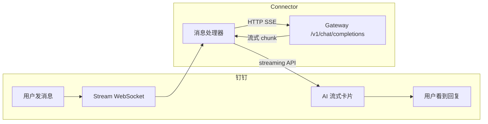
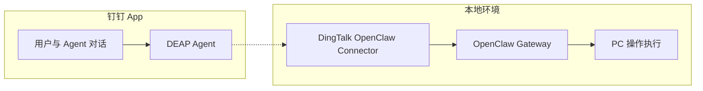

# DingTalk OpenClaw Connector

以下提供两种方案连接到 [OpenClaw](https://openclaw.ai) Gateway，分别是钉钉机器人和钉钉 DEAP Agent。

## 快速导航

| 方案 | 名称 | 详情 |
|------|------|------|
| 方案一 | 钉钉机器人集成 | [查看详情](#方案一钉钉机器人集成) |
| 方案二 | 钉钉 DEAP Agent 集成 | [查看详情](#方案二钉钉-deap-agent-集成) |

# 方案一：钉钉机器人集成
将钉钉机器人连接到 [OpenClaw](https://openclaw.ai) Gateway，支持 AI Card 流式响应和会话管理。

## 特性

- ✅ **AI Card 流式响应** - 打字机效果，实时显示 AI 回复
- ✅ **会话持久化** - 同一用户的多轮对话共享上下文
- ✅ **超时自动新会话** - 默认 30 分钟无活动自动开启新对话
- ✅ **手动新会话** - 发送 `/new` 或 `新会话` 清空对话历史
- ✅ **图片自动上传** - 本地图片路径自动上传到钉钉
- ✅ **主动发送消息** - 支持主动给钉钉个人或群发送消息

## 架构



## 效果


## 安装

### 1. 安装插件

```bash
# 远程安装
openclaw plugins install https://github.com/DingTalk-Real-AI/dingtalk-moltbot-connector.git

# 升级插件
openclaw plugins update dingtalk-connector

# 或本地开发模式
git clone https://github.com/DingTalk-Real-AI/dingtalk-moltbot-connector.git
cd dingtalk-moltbot-connector
npm install
openclaw plugins install -l .
```

> **⚠️ 旧版本升级提示：** 如果你之前安装过旧版本的 Clawdbot/Moltbot 或 0.4.0 以下版本的 connector 插件，可能会出现兼容性问题，请参考 [Q: 升级后出现插件加载异常或配置不生效](#q-升级后出现插件加载异常或配置不生效)。

### 2. 配置

在 `~/.openclaw/openclaw.json` 中添加：

```json5
{
  "channels": {
    "dingtalk-connector": {
      "enabled": true,
      "clientId": "dingxxxxxxxxx",       // 钉钉 AppKey
      "clientSecret": "your_secret_here", // 钉钉 AppSecret
      "gatewayToken": "",                 // 可选：Gateway 认证 token, openclaw.json配置中 gateway.auth.token 的值 
      "gatewayPassword": "",              // 可选：Gateway 认证 password（与 token 二选一）
      "sessionTimeout": 1800000           // 可选：会话超时(ms)，默认 30 分钟
    }
  },
  "gateway": { // gateway通常是已有的节点，配置时注意把http部分追加到已有节点下
    "http": {
      "endpoints": {
        "chatCompletions": {
          "enabled": true
        }
      }
    }
  }
}
```

或者在 OpenClaw Dashboard 页面配置：


### 3. 重启 Gateway

```bash
openclaw gateway restart
```

验证：

```bash
openclaw plugins list  # 确认 dingtalk-connector 已加载
```

## 创建钉钉机器人

1. 打开 [钉钉开放平台](https://open.dingtalk.com/)
2. 进入 **应用开发** → **企业内部开发** → 创建应用
3. 添加 **机器人** 能力，消息接收模式选择 **Stream 模式**
4. 开通权限：
   - `Card.Streaming.Write`
   - `Card.Instance.Write`
   - `qyapi_robot_sendmsg`
5. **发布应用**，记录 **AppKey** 和 **AppSecret**

## 配置参考

| 配置项 | 环境变量 | 说明 |
|--------|----------|------|
| `clientId` | `DINGTALK_CLIENT_ID` | 钉钉 AppKey |
| `clientSecret` | `DINGTALK_CLIENT_SECRET` | 钉钉 AppSecret |
| `gatewayToken` | `OPENCLAW_GATEWAY_TOKEN` | Gateway 认证 token（可选） |
| `gatewayPassword` | — | Gateway 认证 password（可选，与 token 二选一） |
| `sessionTimeout` | — | 会话超时时间，单位毫秒（默认 1800000 = 30分钟） |

## 会话命令

用户可以发送以下命令开启新会话（清空对话历史）：

- `/new`、`/reset`、`/clear`
- `新会话`、`重新开始`、`清空对话`

## 项目结构

```
dingtalk-moltbot-connector/
├── plugin.ts              # 插件入口
├── openclaw.plugin.json   # 插件清单
├── package.json           # npm 依赖
└── LICENSE
```

## 常见问题

### Q: 出现 405 错误


需要在 `~/.openclaw/openclaw.json` 中启用 chatCompletions 端点：

```json5
{
  "gateway": { // gateway通常是已有的节点，配置时注意把http部分追加到已有节点下
    "http": {
      "endpoints": {
        "chatCompletions": {
          "enabled": true
        }
      }
    }
  }
}
```

### Q: 出现 401 错误


检查 `~/.openclaw/openclaw.json` 中的gateway.auth鉴权的 token/password 是否正确：


### Q: 钉钉机器人无响应

1. 确认 Gateway 正在运行：`curl http://127.0.0.1:18789/health`
2. 确认机器人配置为 **Stream 模式**（非 Webhook）
3. 确认 AppKey/AppSecret 正确

### Q: AI Card 不显示，只有纯文本

需要开通权限 `Card.Streaming.Write` 和 `Card.Instance.Write`，并重新发布应用。

### Q: 升级后出现插件加载异常或配置不生效

由于官方两次更名（Clawdbot → Moltbot → OpenClaw），旧版本（0.4.0 以下）的 connector 插件可能与新版本不兼容。建议按以下步骤处理：

1. 先检查 `~/.openclaw/openclaw.json`（或旧版的 `~/.clawdbot/clawdbot.json`、`~/.moltbot/moltbot.json`），如果其中存在 dingtalk 相关的 JSON 节点（如 `channels.dingtalk`、`plugins.entries.dingtalk` 等），请将这些节点全部删除。

2. 然后清除旧插件并重新安装：

```bash
rm -rf ~/.clawdbot/extensions/dingtalk-connector
rm -rf ~/.moltbot/extensions/dingtalk-connector
rm -rf ~/.openclaw/extensions/dingtalk-connector
openclaw plugins install https://github.com/DingTalk-Real-AI/dingtalk-moltbot-connector.git
```

### Q: 图片不显示

1. 确认 `enableMediaUpload: true`（默认开启）
2. 检查日志 `[DingTalk][Media]` 相关输出
3. 确认钉钉应用有图片上传权限

## 依赖

| 包 | 用途 |
|----|------|
| `dingtalk-stream` | 钉钉 Stream 协议客户端 |
| `axios` | HTTP 客户端 |

# 方案二：钉钉 DEAP Agent 集成

通过将钉钉 [DEAP](https://deap.dingtalk.com) Agent 与 [OpenClaw](https://openclaw.ai) Gateway 连接，实现自然语言驱动的本地设备操作能力。

## 核心功能

- ✅ **自然语言交互** - 用户在钉钉对话框中输入自然语言指令（如"帮我查找桌面上的 PDF 文件"），Agent 将自动解析并执行相应操作
- ✅ **内网穿透机制** - 专为本地设备无公网 IP 场景设计，通过 Connector 客户端建立稳定的内外网通信隧道
- ✅ **跨平台兼容** - 提供 Windows、macOS 和 Linux 系统的原生二进制执行文件，确保各平台下的顺畅运行

## 系统架构

该方案采用分层架构模式，包含三个核心组件：

1. **OpenClaw Gateway** - 部署于本地设备，提供标准化 HTTP 接口，负责接收并处理来自云端的操作指令，调动 OpenClaw 引擎执行具体任务
2. **DingTalk OpenClaw Connector** - 运行于本地环境，构建本地与云端的通信隧道，解决内网设备无公网 IP 的问题
3. **DingTalk DEAP MCP** - 作为 DEAP Agent 的扩展能力模块，负责将用户自然语言请求经由云端隧道转发至 OpenClaw Gateway



## 实施指南

### 第一步：部署本地环境

确认本地设备已成功安装并启动 OpenClaw Gateway，默认监听地址为 `127.0.0.1:18789`：

```bash
openclaw gateway start
```

#### 配置 Gateway 参数

1. 访问 [配置页面](http://127.0.0.1:18789/config)
2. 在 **Auth 标签页** 中设置 Gateway Token 并妥善保存：

   

3. 切换至 **Http 标签页**，启用 `OpenAI Chat Completions Endpoint` 功能：

   

4. 点击右上角 `Save` 按钮完成配置保存

### 第二步：获取必要参数

#### 获取 corpId

登录 [钉钉开发者平台](https://open-dev.dingtalk.com) 查看企业 CorpId：


#### 获取 apiKey

登录 [钉钉 DEAP 平台](https://deap.dingtalk.com)，在 **安全与权限** → **API-Key 管理** 页面创建新的 API Key：


### 第三步：启动 Connector 客户端

1. 从 [Releases](https://github.com/hoskii/dingtalk-moltbot-connector/releases/tag/v0.0.1) 页面下载适配您操作系统的安装包
2. 解压并运行 Connector（以 macOS 为例）：

   ```bash
   unzip connector-mac.zip
   ./connector-darwin -deapCorpId YOUR_CORP_ID -deapApiKey YOUR_API_KEY
   ```

### 第四步：配置 DEAP Agent

1. 登录 [钉钉 DEAP 平台](https://deap.dingtalk.com)，创建新的智能体：

   

2. 在技能管理页面，搜索并集成 OpenClaw 技能：

   

3. 配置技能参数：

   | 参数 | 来源 | 说明 |
   |------|------|------|
   | apikey | 第二步获取 | DEAP 平台 API Key |
   | apihost | 默认值 | 通常为 `127.0.0.1:18789`，在Windows环境下可能需要配置为 `localhost:18789` 才能正常工作 |
   | gatewayToken | 第一步获取 | Gateway 配置的认证令牌 |

   

4. 发布 Agent：

   

### 第五步：开始使用

1. 在钉钉 App 中搜索并找到您创建的 Agent：

   

2. 开始自然语言对话体验：

   

## License

[MIT](LICENSE)
